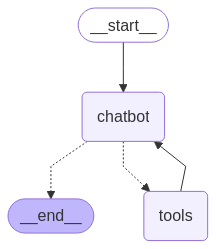

### Stock Market Agentic Chatbot

An intelligent chatbot designed for comprehensive stock market analysis through document processing and interactive conversations. Upload your trading documents, PDFs, or DOCX files to create a personalized knowledge base for market insights and trading strategies.

### Features

- **Document Upload & Processing**: Support for PDF and DOCX files up to 200MB
- **Knowledge Base Creation**: Automatically processes stock market documents to build searchable knowledge
- **Interactive Chat Interface**: Ask questions about trading concepts, market analysis, and specific stocks
- **Real-time Analysis**: Get instant insights from your uploaded trading materials
- **Trading Education**: Learn about various trading concepts like stop-limit orders, NIFTY 50, and more

### Technology Stack

- **Frontend**: Streamlit.
- **Backend**: Document processing and storing the knowledge in Pinecone vector db for retieval.
- **File Support**: PDF, DOCX formats
- **Chat System**: Real-time conversational AI for stock market queries

 

- The tools are financial tools from polygon, retieral tool(using pinecone), tavilty tool. Chatbot intearact with the tools for market analysis.

 ### Agent in action:
  
- 
